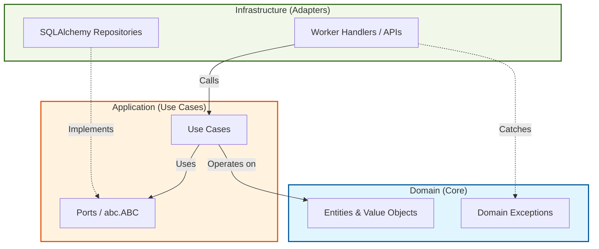

# Architecture Spine: xgplib-workers

## Overview

This project adheres strictly to **Clean Code and Hexagonal Architecture (Ports and Adapters)** principles. The goal of this spine is to document the invariants that prevent architectural drift, ensuring the core domain remains pure, testable, and completely decoupled from infrastructure concerns (frameworks, databases, external APIs).

## 1. Paradigm & Boundaries

- **Core Paradigm:** Hexagonal Architecture (Ports and Adapters).
- **Dependency Rule:** All dependencies must point inward toward the Domain. The Domain knows nothing about the Application layer, and the Application layer knows nothing about the Infrastructure layer.

## 2. Invariants (Architectural Decisions)

### AD-1: Boundary Enforcement
- **Binds:** Dependency Rule Enforcement.
- **Prevents:** Architectural drift where domain logic implicitly couples to infrastructure.
- **Rule:** Boundaries are enforced by folder convention (`src/domain`, `src/application`, `src/infrastructure`). This is validated continuously via static analysis tools (specifically **Ruff** for styling and import linting) and rigorous Code Review. We prioritize convention and fast linters over complex architectural testing frameworks.

### AD-2: Dependency Injection Strategy
- **Binds:** Dependency Injection Orchestration.
- **Prevents:** Hardcoded concrete infrastructure dependencies inside application use cases, which complicates testing and flexibility.
- **Rule:** Dependency Injection must be orchestrated via a **DI Container framework** (rather than manual wiring). This standardizes how components receive their dependencies as the project scales, ensuring the Application layer only asks for abstractions.

### AD-3: Port (Interface) Definition Standard
- **Binds:** Port (Interface) Definition Standard.
- **Prevents:** Inconsistent contract definitions or runtime failures from incomplete structural typing.
- **Rule:** Ports (the interfaces defining what the domain needs from infrastructure) must be defined using Python's native `abc.ABC` (Abstract Base Classes). This enforces explicit implementation and ensures fail-fast instantiation if an adapter is missing methods.

### AD-4: Use Case State Mutation Flow
- **Binds:** Use Case State Mutation Flow.
- **Prevents:** Overly complex functional workarounds or scattered state changes outside of controlled boundaries.
- **Rule:** Use Cases (Application layer) are responsible for orchestrating state mutation imperatively. The flow is standard: retrieve entities via ports, invoke domain logic on the entity, and explicitly call port methods (e.g., `save`) to persist the new state.

### AD-5: Error Handling Strategy
- **Binds:** Error Handling Strategy.
- **Prevents:** Infrastructure-level errors polluting the domain, or domain logic being bogged down by checking Result monads.
- **Rule:** Domain and Application layers raise explicit, custom Domain Exceptions (e.g., `DomainError`, `EntityNotFound`). The outermost layer (Adapters/Entrypoints) is exclusively responsible for catching these exceptions and translating them into the appropriate infrastructure response (e.g., specific logs, queue NACKs, HTTP codes).

### AD-6: Foundational Stack
- **Binds:** Foundational Stack.
- **Prevents:** Tooling sprawl and reinventing the wheel with non-standard libraries.
- **Rule:** We adopt industry-standard Python tooling as our base:
  - **SQLAlchemy:** For ORM and persistence in the Infrastructure layer.
  - **Pydantic:** For Data Transfer Objects (DTOs) and configuration validation.
  - **Ruff:** For fast, unified linting and formatting.

## 3. Structural Design

## 4. Deferred Decisions
- *None explicitly deferred at this stage.*

---
*Generated by BMad Architecture Skill.*